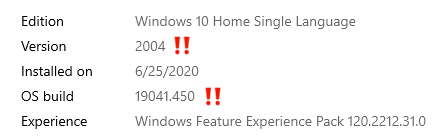
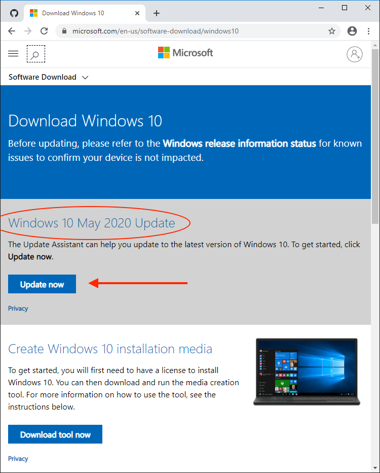

Howdy neighbor. Have you heard the news about WSL2? As of June 2020, WSL is available to the general public. I figured this would be a good opportunity to share my findings with you, the general public. But more specifically, Flatiron Students using WSL.

# What is the Windows Subsystem for Linux? 

The Windows Subsystem for Linux (WSL) lets developers run a Linux environment directly on Windows 10 without the overhead of a virtual machine. It’s an unmodified OS, but highly integrated into Windows.

WSL1 was groundbreaking and translated Linux system calls to Windows equivalents. This could be slow and several features weren’t available. WSL2 uses Hyper-V virtual machine technology so Linux compatibility is excellent and file access is up to 20x faster than before.

## Table of Contents:
0. [Windows 10 Requirements](#requirements)
1. [Updating and Configuring Windows 10](#updating-and-configuring-windows-10) 
2. [Enabling Windows Subsystem for Linux (WSL) && Virtual Machine Platform](#enable-wsl2)
3. [Installing Ubuntu](#install-ubuntu)
4. [Upgrading to WSL Packages and Ubuntu Version](#upgrade-wsl)
5. [Flatiron Local Environment Set Up](#flatiron-tools)
6. [Install Ruby Version Manager](#rvm)
7. [Gem Installations](#gems)
8. [Configure Git](#git)
9. [Node Version Manager](#nvm)
10. [Visual Studio Code](#vscode)
11. [Generating a SSH Key](#ssh)
12. [Updating Learn Config](#learn-config)
13. [Creating Flatiron Folders](#labs-directory)
14. [Adding Flatiron Customization To Your Terminal](#customization)

<br/>

---
<br/>

## Windows 10 Requirements <a name="requirements"></a>
WSL2 is compatible with the Home, Pro, or Server editions of Windows but not Windows' 10 S (although you can often upgrade to the Home edition for free).

The Windows May 2020 update is essential — that’s version 2004 or above. Choose the **Settings** cog from the Start menu, then select **System** followed by **About**. The Windows specifications are shown at the bottom of the panel:

<br/>

<p align="center">

  

</p>


<br/>

> *NOTE: Some PCs report that version 2004 is currently unavailable in the Windows Update panel. Alternatively, you can try downloading the [Windows Update Assistant][]. If this does not work, you may not be able to upgrade until Microsoft has released a fix for your device*


> *WARNING: Fiddling with your BIOS settings can trash your PC! Be careful when making changes. Consult your manufacturer’s help pages or search for online advice about your specific make and model.*

<br/>

That warning out of the way, hardware virtualization will be active on **most** devices, but you can check by rebooting, and opening the BIOS panels — typically by hitting the DEL, F2, or F10 key as the system starts. Look for **Virtualization Technology**, **VTx** or similar options. Ensure they are enabled, save, and reboot the device.

Finally, ensure your C: drive has at least 1GB of spare disk space — ideally more. You may be able to free up some space in **Settings**, **System**, **Storage** or using the **Disk clean-up** tool in **Windows Administrative Tools**.


<br/>
<br/>

## Updating and Configuring Windows 10 <a name="updating-and-configuring-windows-10"></a>

1. Make sure to run: [Windows Update Assistant][]. When the update is complete, your system build should be greater than 19000. Please verify this is true before continuing.

[Windows Update Assistant](https://www.microsoft.com/en-us/software-download/windows10)

<br/>

<p align="center">
  
</p>

<br/>
<br/>

## Enabling Windows Subsystem for Linux (WSL) && Virtual Machine Platform <a name="enable-wsl2"></a>

Windows Subsystem Linux (WSL) is **not** automatically enabled on windows. So, to start off, we need to enable it!

1. Go to your Windows Search bar and type in `Turn Windows Features On or Off`. Click on the result that matches your query. It will be in your Control Panel.  You should see something like this:

<br/>

<p align="center">
  
</p>

<br/>

2. Scroll down until you see "Windows Subsystem for Linux" - ensure its box is checked!

<br/>

<p align="center">
  
</p>  


<br/>

3. Scroll up a bit until you see "Virtual Machine Platform." Turn this feature on as well.

<br/>

<p align="center">
  
</p>  


 When that's complete, it should look like this:

<p align="center">
  
</p>

<br/>

4. Click `ok`. This will prompt Windows to completely restart. Do so, grab some water, and let's continue!

<br/>
<br/>

## Installing Ubuntu <a name="install-ubuntu"></a>

1. Open up [Microsoft Store](https://www.microsoft.com/en-us/p/ubuntu/9nblggh4msv6?activetab=pivot:overviewtab). Search for "[Ubuntu](https://www.microsoft.com/en-us/p/ubuntu/9nblggh4msv6?activetab=pivot:overviewtab)"

2. Choose "Ubuntu" (do NOT choose 16.04 LTS, 18.04 LTS, or 20.04LTS)

<br/>

<p align="center">
  
</p>

<br/>


3. Search for, and open the newly installed Ubuntu application.

4. Choose a username -- I suggest picking a really simple username (like a short nickname).

<br/>

**NOTE:**
-  Ubuntu will not accept capital letters in a username
-  Ubuntu will not accept numbers at the start of a username

<br/>

5. Choose a password -- I suggest picking a really really simple password.

<br/>

**NOTE:**
- When you start typing a password, it will look as though nothing is happening. Thats totally normal, it's just a security feature. 
- Type whatever password you would like, and press enter.
- It will prompt you to confirm your password, retype the same password and hit enter.

<br/>

Once you have set up a username and password, you should return to a normal bash prompt (what does that even mean!?). It should look something like this:

<br/>

<p align="center">
  
</p>

<br/>
<br/>

## Upgrading to WSL Packages and Ubuntu Version (via Command Prompt as Admin) <a name="upgrade-wsl"></a>

At this point, you've already installed WSL1, we just need to run a few commands to update it to WSL2. The next few commands are a little quirky, but, extremely important.

1. [Click this link](https://wslstorestorage.blob.core.windows.net/wslblob/wsl_update_x64.msi) -- it will download the necessary msi package. The package's name should be something along the lines of: `wsl_update_x64.msi`.

2. Double click on the package and follow the necessary prompts to install. (It should take approx 30 seconds to install.)

3. Now, in your Windows Search bar, search for an application named `Command Prompt`. click **Run as Administrator**.

<br/>

<p align="center">
  
</p>

<br/>

4. Inside Command Prompt (running as administrator), copy and paste the code below:

    ```
    wsl --set-default-version 2
    ```


<br/>

<p align="center">
  
</p>

<br/>

5. The following command will change your version of Ubuntu from 1, to 2. Run: 

    ```
    wsl.exe --set-version Ubuntu 2
    ```


<br/>
<br/>

Annnddd That's it for WSL2 you _should_ be good to go on your WSL2 installation. Let's move on to our Learn Local Environment installation.


<br/>
<br/>

## Flatiron Tools <a name="flatiron-tools"></a>

Okay, so now we can start setting up our Ubuntu system with Flatiron tools! First, let's close and reopen Ubuntu. Then run the commands below.

1. Run the following command in your Ubuntu terminal. This will make sure your currently installed packages in your Ubuntu system are up to date:
    ```
    sudo apt-get update
    ```


2. Then run the following command to install a few important packages. (copy the entire block of code)
    ```
    sudo apt-get install git-core curl zlib1g-dev build-essential libssl-dev libreadline-dev libyaml-dev libsqlite3-dev sqlite3 libxml2-dev libxslt1-dev libcurl4-openssl-dev software-properties-common libffi-dev libpq-dev libgdbm-dev libncurses5-dev automake libtool bison gnupg postgresql postgresql-contrib
    ```

<br/>
<br/>

## Ruby Version Manager <a name="rvm"></a>

Next, we'll install [Ruby Version Manager](https://github.com/rvm/ubuntu_rvm), also known as RVM. I've purposefully listed commands 3 through 7 separately. Do not run them all at the same time -- run them in succession. The combined 5 commands will install RVM.

3. Run:
    ```
    sudo apt-get install software-properties-common
    ```

4. Run:
    ```
    sudo apt-add-repository -y ppa:rael-gc/rvm
    ```

5. Run:
    ```
    sudo apt-get update
    ```

6. Run:
    ```
    sudo apt-get install rvm
    ```

7. Run:
    ```
    source ~/.bashrc
    ```

For all intents and purposes, RVM is now installed. However, to start using it, you must ***SHUT DOWN YOUR UBUNTU TERMINAL AND REOPEN IT AGAIN.***

Moving right along, let's install the Ruby version compatible with Flatiron labs, we want to download ruby 2.6.1 and set it as our default:

8. This following will install Ruby version 2.6.1, which is what Flatiron uses for its curriculum. Run:
    ```
    rvm install 2.6.1
    ```


9. The following will set Ruby version `2.6.1` to be our default Ruby. Run: 
    ```
    rvm use 2.6.1 --default
    ```


<br/>
<br/>

## Gem Installations <a name="gems"></a>

10. The following will install a Ruby gem named [Bundler](https://rubygems.org/gems/bundler). (follow the hyperlink if you are curious as to what Bundler does) Run:
    ```
    gem install bundler
    ```


11. The following will allow you to use commands like "*learn open*", "*learn test*", and "*learn submit*". For more information on the [Learn gem](https://rubygems.org/gems/learn-co), follow that hyperlink!  Run: 
    ```
    gem install learn-co -v 3.9.6
    ```


**NOTE:**
After installing the Learn gem, you will get a weird error that looks something like:
    
```
  RDoc is not a full Ruby parser and will fail when fed invalid ruby programs.

  The internal error was:
      (NoMethodError) undefined method `[]' for nil:NilClass
      ERROR:  While executing gem ... (NoMethodError)
      undefined method `[]' for nil:NilClass
```

This error is okay; it is the only error I will suggest ignoring!


  Before we continue, let's configure our new installed learn-co gem. We'll do part of the configuration now, and another part later! 

  - First run: &nbsp; &nbsp;  `cd ~` <br>

  - Next run: &nbsp; &nbsp;  `learn whoami` <br>
    That last command will ask you to to retrieve some information and bring it back to terminal. That information can be found on your [learn.co](https://www.learn.co/) profile page. So, head to [learn.co](https://www.learn.co/), click on your profile picture in the top right, then click on the "**Your Profile**" link. On your profile page, scroll to the bottom and copy your OAuth token. YOU ONLY NEED TO COPY EVERYTHING AFTER "OAuth token:". For example, mine looks like this:

    ```
    9cd7da7faf8d978cb613008bdb56e4fc2dsdfs642sdfds91eb70b5d8d3b2820fd91
    ```

  - Copy your token and paste it into terminal. <br/>
    If all goes well, your terminal _should_ display some information about you, similar to this:

    ```
    ➜ learn whoami
    Connecting to Learn...
    Authenticating...
    Name:      Dwayne 👾
    Username:  dwyn
    Email:     dwayne.harmon@flatiron.com
    Learn Dir: /Users/dharmon/Development/code
    ```


12. The following will install the lovely debugging tool [Pry](https://rubygems.org/gems/pry). Seriously ask yourself, where would you be without [Pry](https://rubygems.org/gems/pry)!? Run:
    ```
    gem install pry
    ```


13. As if [Rails](https://rubygems.org/gems/rails) needs an introduction! (but just incase, follow the hyperlink!) Run:
    ```
    gem install rails
    ```


14. [Nokogiri](https://rubygems.org/gems/nokogiri) has many uses -- You will primarily use it to scrape websites so definitely install it and check out the documentation. Run: 
    ```
    gem install nokogiri
    ```

That should be all for necessary gems. Let's move on to configuring our version control! 

<br/>
<br/>

## Configure Git<a name="git"></a>

15. This (and the next 2 commands) will set up git in your system. When you enter these commands, your terminal will not say anything -- don't worry, it definitely worked! Run:
    ```
    git config --global color.ui true
    ```


*For the next few commands, make sure to input your specific information:*

16. Please please please replace your YOUR_GITHUB_USER_NAME, with your actual github username. For example, mine would look something like: &nbsp;  *git config --global user.name "dwyn"* &nbsp; Run: 
    ```
    git config --global user.name YOUR_GITHUB_USER_NAME
    ```

    Alternatively, you could just put your first and last name, like so:

    ```
    git config --global user.name "First_Name Last_Name"
    ```


17. The following is essentially repeating the same process, but with the email address tied to your github account. Run
    ```
    git config --global user.email YOUR_GITHUB_EMAIL_ADDRESS
    ```

<br/>
<br/>

## Node Version Manager <a name="nvm"></a>
[Node Version Manager](https://www.keycdn.com/blog/node-version-manager#:~:text=What%20is%20Node%20Version%20Manager,via%20the%20command%20line%20interface.) is a tool that allows programmers to seamlessly switch between different versions of Node. I would say it's akin to Ruby Version Manager, but for Node. [Node](https://www.codecademy.com/articles/what-is-node) allows developers to write JavaScript code that runs directly in a computer process itself instead of in a browser.


20. The following will install NVM, baby! &nbsp; Run:
    ```
    curl -o- https://raw.githubusercontent.com/nvm-sh/nvm/v0.35.1/install.sh | bash
    ```


21. Let's refresh your terminal! &nbsp; Run:
    ```
    source ~/.bashrc
    ```


22. The following will install Node.JS! Run: 
    ```
    nvm install node
    ```
 
<br/>

---

**Water Break!** <br/>
Take a moment to close your eyes, focus on your breathing, maybe even hydrate a bit.

---

<br/>

## Visual Studio Code <a name="vscode"></a>

There are plenty of text editors out there. As of today 8.1.2020, do yourself a favor and just use Visual Studio Code.

1. <a href="https://code.visualstudio.com/download" target="_blank">Follow this link to download VSCode</a>. Choose the Windows download, not the Linux download. 

**NOTE:**

As VSCode is installing, make sure to check all check boxes so that it installs for your entire system.

2. To configure your Ubuntu terminal to be available in VSCode:

    - open up VSCode
    - open the Command Palette via `F1` or &nbsp; `Ctrl` &nbsp; + &nbsp; `Shift` &nbsp; + &nbsp; `p`
    - begin typing the following: `Terminal: Select Default Shell`  until you
      see it. Select that option.

<br />

<p align="center">

</p>

<br/>

    - Once you select it, a few options will pop up. You want to select WSL Bash C:\WINDOWS\System32\wsl.exe.

<br />

<p align="center">
  
</p>

<br />

3. Now, you can use your Ubuntu terminal in VSCode. Select "New Terminal" in
    the "Terminal" drop-down, or type `Ctrl` + `Shift` + \` (ctrl + shift + backtick) in order to use it!

4. Install the [Remote - WSL extension](https://marketplace.visualstudio.com/items?itemName=ms-vscode-remote.remote-wsl) for VSCode. The Remote - WSL extension extension lets you use WSL as your full-time development environment right from VS Code!

<br/>
<br/>

## Generating a SSH Key <a name="ssh"></a>

  You can either communicate with your remote repositories via HTTPS or SSH.
  Let's use SSH so you will not have to authenticate with
  your GitHub username and password everytime you run &nbsp; *learn save* , &nbsp; *learn submit* ,  or any other commands `push` code to GitHub.

1. Run: 
    ```
    ssh-keygen
    ```

  - You will be asked where to save the new ssh file. Just press **enter** to save it in the default location. <br/>

  - You will be asked for a passphrase -- <span style="color:red;">**DO NOT ENTER A PASSPHRASE!**</span> Simply press **enter**, twice.

You will know the process is complete once you have some randomly generated ASCII art in your terminal. Now, let's retrieve the contents of that file.

2. Run:
    ```
    cat ~/.ssh/id_rsa.pub
    ```

  This should print out a really long string of characters starting with *ssh*. It will look *something like this*:

  ```
  ssh-rsa AAAAB3NzaC1yc2EAAAADAQABAAABgQDI0n1zGPzhpwJRCwn0KeI8BybeyZP1XJWaGnvBMJNfzvXVhRGX5TxZ6Aq2hvHtDVE0ST9O1L2PU802RN5in6mpwCWoeJx9HXKoI3KW1nAYMJH8LjR1I2nbm7cSZjg732CdElc3uwTMf0cU7S2oocH5vTYpBT20NsdfsdsdfsdQaHdfAlop6VVckZKNZbPLNiW1MO2rk7Hw1j6r6bDM1nFwV+uDzxJ7+uEBXpl6bsxVn7X8AmwZdLSYz6wTq1lXWTy46tfkkFPNFyu5akkYoTym3jnQpKdW6AOVl89dXfRira4+DF7mQt3+kcfqHVsC7nN4s5T2Ju2KrVYiKF4yo89CXd7Yu6EQx7JeRlw+kxtzgYo1enMnp4hAawgxCkWlEqWyJQkNVZ6Wq+/gcHezJr2PoUc3lTX61TUcoCXV3QkjJDmnsSiwVDUqypCEBtNZyKMX5ZjSESPaj24C3F/yOdWIQu40iUR8oOT86Xo9+waR/nIobxaqWLJ4I8vfVqXsrh0ZTU= dharmon@skynet.attlocal.net
  ```

  <p align="center">
    
  </p>

  ***Just keep in mind, yours will look *similar*... not the same!***

<br />

3. copy whatever ***your*** ssh key is, and follow this link: [Github New SSH](https://github.com/settings/ssh/new).

4. In the top input field, enter something meaningful. Such as, computer name, purpose for the key and date are solid options.

5. Paste your ssh key in the lower box. After you've completed both, your page should look similar to this:

<br />

<p align="center">
  
</p>

<br />

6. Click "*Add SSH key*", and that's all! Your ssh key has been generated on your computer, and linked to Github! Yeth!

<br/>
<br/>


## Updating Learn Config <a name="learn-config"></a>
First things first, let's completely close VSCode, and Ubuntu. Then, let's re-open only Ubuntu.

1. Let's find your Windows 10 username. To do so, we will have to use **Command Prompt** again. Open the Command Prompt app and run: 

    ```
    echo %username%
    ```

    You can close Command Prompt (Just remember to write down your Windows 10 username.). 

<p align="center">
  
</p>

  <br/>

2. Back in your **Ubuntu Terminal**, run: 

    ```
    code ~/.learn-config
    ```
    This command  _should_ open a `.learn-config` config file in VSCode.

3. You want to update this file so that it looks EXACTLY the same as below (except for YOUR-WINDOWS-USERNAME of course)
<br />

**NOTE**:

If your username contains any spaces in it, you will need to escape them in your .learn-config file. There are a couple ways to do this, the easiest is with a backslash. For example if my username was "Dwayne Harmon", I could escape the space between my first and last name with a backslash, like so: `Dwayne\ Harmon`.
In practice, the example would look like this: <br /> 
`:learn_directory: "/mnt/c/Users/Dwayne\ Harmon/development/flatiron/labs"`.
  
<br/>

In any event, update your .learn-config file.

    ```
    ---
    :learn_directory: "/mnt/c/Users/YOUR-WINDOWS-USERNAME/development/flatiron/labs"
    :editor: code
    ```

<br/>

4. Save this file, and close it.

<br/>
<br/>

## Creating Flatiron Folders <a name="labs-directory"></a>

You'll notice that we set up our `.learn-config` file earlier with a path destination of `/mnt/c/users/YOUR-WINDOWS-USERNAME/development/flatiron/labs`. For this to actually work, we have to make sure those folders exist in your computer. To do this, begin by navigating to your Windows 10 home directory:


1. Run: &nbsp; &nbsp;  `cd /mnt/c/Users/YOUR-WINDOWS-USERNAME`

<p align="center">
  
</p>

Now, let's make the appropriate files. `mkdir` creates a new directory
which will be a subdirectory of the current directory location of your terminal.

2. Run the entire block below:
```
mkdir development && mkdir development/flatiron && mkdir development/flatiron/labs && cd ~
```
<br/>

Now you have the directories you need! `learn open` should work seamlessly by adding your most current lab to the
`labs` directory we just made.

<br/>
<br/>

## Adding A Flatiron Customization To Your Terminal<a name="customization"></a>

1. Start out by making a backup for your `.bashrc`

    ```
    mv .bashrc .bashrc.bak
    ```

2. We will want a tool for converting Windows endings to Unix endings for our new
`.bashrc`

    ```
    sudo apt-get install dos2unix
    ```

3. download the new `.bashrc`

    ```
    curl -R "https://raw.githubusercontent.com/Enoch2k2/flatiron-wsl-bashrc/master/.bashrc" >> $HOME/.bashrc
    ```

4. We'll use our converter to convert our bashrc to use the right unix endings:

    ```
    dos2unix .bashrc
    ```
<br/>
<br/>

--- 

<br/>
<br/>

## Important Knowledge: Basic Use

Your terminal is actually accessing an Ubuntu Virtual Machine which is running
inside of your Windows OS. If you ever `cd` in your terminal, you will be
sent to the 'user home' of your Linux VM. That is also the default location you
will be in when you open your Ubuntu app. You actually want to do all of your
business inside of your normal Windows file space, not your Linux VM file space.
So, you will need to know how to navigate in your terminal from your Ubuntu file
system to your Windows file system. This is pretty simple if you understand how
the system is set up, so let's go over that quickly.

To allow you to access the functionality of a Linux machine, Windows stores the
Ubuntu OS and file system inside of its own file system. You should NEVER access
your Ubuntu files via your Windows machine. What you SHOULD do is save
everything you are working on in your normal Windows filespace, and access that
via your Ubuntu terminal. So, how do you do that? Well, from the Ubuntu's point
of view, it is just a normal Linux machine, but Microsoft has made a pathway
between the Linux VM and your Windows OS via the `/mnt` directory in your
Ubuntu's root.

Here is a quick visual of what the first few levels of any Linux filesystem look
like:  


As you can see, the `mnt` directory is made for other filesystems, so that is
where Microsoft connected your Linux to your Windows machine:


So, you can get there from your starting point by typing:

```
cd /mnt/c/users/YOUR-WINDOWS-USERNAME
```

or

```
cd ../../mnt/c/users/YOUR-WINDOWS-USERNAME
```

Remember, put all of your stuff in your windows directories! That way, you have
access to it via your Linux Terminal or your Windows OS, and your VSCode editor
can open to the correct location when you use

```
code .
```

(if you are in your Linux file system, VSCode will open, but not to the right spot).

<br/>
<br/>

--- 

<br/>
<br/>

## FAQ

If you get the error: `Windows Subsystem for Linux has no installed
distributions. Distributions can be installed by visiting the Windows Store:
https://aka.ms/wslstore Press any key to continue...`

1. Search for 'Services' in your Windows search bar, open it up  


2. Scroll down to the `L` section, and find `LxssManager`. If it is running,
right click and `Restart` it. If it is not running, right click it and
`Start` it.  


[You can check out the github issue here](https://github.com/Microsoft/WSL/issues/2576)

<br/>
<br/>
<br/>

---
<br/>
<br/>
<br/>

## Resources

1. [Setting up a SSH Key with GitHub](https://help.github.com/articles/adding-a-new-ssh-key-to-your-github-account/)  
2. [Microsoft Documentation: Windows Subsystem for Linux]( https://docs.microsoft.com/en-us/windows/wsl/install-win10)  
3. [Basic Linux Commands](https://maker.pro/linux/tutorial/basic-linux-commands-for-beginners)
[The Complete Developer's Guide to Windows Subsystem for Linux 2](https://www.sitepoint.com/wsl2-windows-terminal/)

[VS Code]: https://code.visualstudio.com/download
[WSL Installation Guide]: https://docs.microsoft.com/en-us/windows/wsl/install-win10
[Hack font]: https://sourcefoundry.org/hack/
